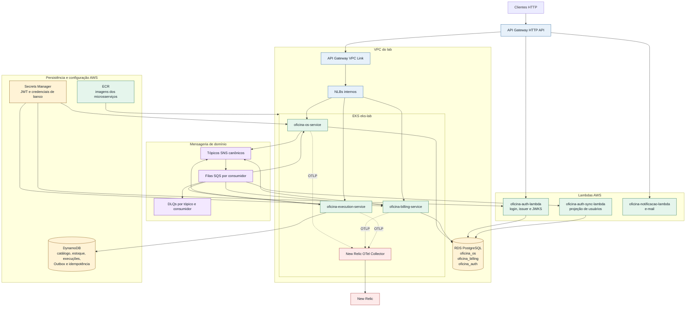

# oficina-infra

Repositório canônico de infraestrutura compartilhada da suíte da oficina mecânica.

Este repositório concentra os artefatos executáveis que antes ficavam distribuídos entre `oficina-infra-db` e `oficina-infra-k8s`, preservando as decisões de governança do `oficina-platform`.

Inventário de cópia e adaptação: [Inventário de migração dos repositórios legados](docs/migration-inventory.md).

## Ambiente canônico

| Item | Valor |
|---|---|
| Região AWS | `us-east-1` |
| Ambiente | `lab` |
| Infraestrutura compartilhada | `eks-lab` |
| State Terraform | `oficina/lab/infra/terraform.tfstate` |

### Arquitetura do lab



As rotas públicas e o fluxo interno estão detalhados em [API Gateway e rotas públicas](../oficina-platform/docs/infrastructure/api-gateway-public-routes.md); ownership, eventos e persistência permanecem normativos no [`oficina-platform`](../oficina-platform/).

## RDS PostgreSQL compartilhado

O primeiro artefato provisionável deste repositório é o RDS PostgreSQL compartilhado da Fase 4:

```text
oficina-postgres-lab
+-- oficina_os / oficina_os_user
+-- oficina_billing / oficina_billing_user
+-- oficina_auth / oficina_auth_user
```

Documentação operacional: [RDS PostgreSQL compartilhado](docs/rds-postgresql.md).

## DynamoDB e mensageria

O Terraform do ambiente `lab` provisiona as tabelas DynamoDB do `oficina-execution-service` e a mensageria SNS/SQS da Fase 4:

- tabelas `oficina-execution-lab-catalogo`, `oficina-execution-lab-estoque`, `oficina-execution-lab-execucoes`, `oficina-execution-lab-outbox` e `oficina-execution-lab-idempotencia`;
- tópicos SNS canônicos convertidos para nomes físicos com hífen, por exemplo `oficina.execution.execucao-finalizada` como `oficina-execution-execucao-finalizada`;
- filas SQS por consumidor, DLQs por tópico e assinaturas com `RawMessageDelivery=true`;
- políticas IAM gerenciadas separadas para publicação, consumo e acesso DynamoDB.

Documentação operacional: [DynamoDB e mensageria da Fase 4](docs/dynamodb-messaging.md).

## Ambiente local integrado

Para testes locais de dependências e APIs dos três microsserviços, use o Compose local:

```bash
docker compose -f compose.local.yml up -d postgres dynamodb localstack
scripts/local/bootstrap-local.sh
```

Documentação: [Ambiente local integrado](docs/local-integration.md).

## Kubernetes dos microsserviços

Cada microsserviço mantém sua base Kubernetes executável em `k8s/base/`; este repositório é a fonte canônica da composição do ambiente `lab`. A estratégia de entrega está definida em [Estratégia de entrega dos manifestos Kubernetes](../oficina-platform/docs/infrastructure/kubernetes-manifest-strategy.md).

As bases Kubernetes canônicas estão materializadas em `k8s/base/` de cada repositório de microsserviço. Este repositório mantém componentes compartilhados e a composição do ambiente `lab`; [scripts/manual/apply-microservices.sh](scripts/manual/apply-microservices.sh) consome as bases dos serviços depois do bootstrap dos databases.

O script cria ou atualiza os secrets Kubernetes de runtime, resolve `OFICINA_AUTH_ISSUER` e `MP_JWT_VERIFY_PUBLICKEY_LOCATION`, sincroniza a chave pública JWT quando o secret `oficina/lab/jwt` está disponível, descobre a imagem mais recente de cada repositório ECR canônico e aplica apenas os serviços que já têm imagem publicada. Também grava checksums dos secrets de runtime como annotations no template dos Deployments, para que mudanças em senha de banco ou chave JWT gerem novo ReplicaSet automaticamente. Quando ainda não há imagem de um serviço no ECR, o Deployment desse serviço é ignorado nessa execução para evitar pods com `IMAGE_PLACEHOLDER`.

Os workflows dos microsserviços também usam esse script para materializar ou atualizar apenas o próprio serviço. Para isso, informam `MICROSERVICE_NAMES=<nome-do-servico>`, a variável de imagem correspondente (`OFICINA_OS_SERVICE_IMAGE`, `OFICINA_BILLING_SERVICE_IMAGE` ou `OFICINA_EXECUTION_SERVICE_IMAGE`) e `WAIT_MICROSERVICE_ROLLOUT=true`. Quando `OFICINA_AUTH_ISSUER` não é informado e o Terraform output não está disponível no checkout do workflow do serviço, o script descobre o endpoint pelo HTTP API `API_GATEWAY_NAME`, cujo padrão é `eks-lab-http-api`.

Para acessar localmente os microsserviços implantados no EKS sem publicar endpoints operacionais no API Gateway, use o port-forward controlado:

```bash
scripts/manual/start-port-forwards.sh
```

O script encaminha os Services Kubernetes para portas locais e valida `/q/openapi` e `/q/swagger-ui` de cada microsserviço:

| Serviço | Swagger UI | OpenAPI |
|---|---|---|
| `oficina-os-service` | `http://localhost:8081/q/swagger-ui` | `http://localhost:8081/q/openapi` |
| `oficina-billing-service` | `http://localhost:8082/q/swagger-ui` | `http://localhost:8082/q/openapi` |
| `oficina-execution-service` | `http://localhost:8083/q/swagger-ui` | `http://localhost:8083/q/openapi` |

Se alguma porta local já estiver em uso, sobrescreva `OFICINA_OS_LOCAL_PORT`, `OFICINA_BILLING_LOCAL_PORT` ou `OFICINA_EXECUTION_LOCAL_PORT`. Para restringir a execução, use `MICROSERVICE_NAMES=oficina-os-service`.

## Observabilidade New Relic

O New Relic OpenTelemetry Collector do ambiente `lab` é instalado via Helm no cluster `eks-lab`, usando license key fornecida por variável/secret de deploy e valores versionados em [k8s/components/new-relic-otel-collector/values.lab.yaml](k8s/components/new-relic-otel-collector/values.lab.yaml). No workflow de deploy, o modo padrão `INSTALL_NEW_RELIC_OTEL_COLLECTOR=auto` instala ou atualiza o collector quando a secret GitHub `NEW_RELIC_LICENSE_KEY` está configurada.

Documentação operacional: [New Relic OpenTelemetry Collector no EKS lab](docs/new-relic-otel-collector.md).

## Simulação operacional

O [simulador de operação da oficina](docs/workshop-simulator.md) gera tráfego sintético determinístico e seguro nas APIs públicas de ambientes não produtivos. Antes de uma execução controlada, valide o perfil em modo `dry-run`:

```bash
scripts/manual/simulate-workshop.py --dry-run --profile cotidiano --duration 2 --intensity 5 --seed 20260715
```

Arquivos principais:

- [terraform/environments/lab/](terraform/environments/lab/)
- [terraform/modules/rds-postgres/](terraform/modules/rds-postgres/)
- [terraform/modules/dynamodb_execution/](terraform/modules/dynamodb_execution/)
- [terraform/modules/domain_messaging/](terraform/modules/domain_messaging/)
- [terraform/modules/eks/](terraform/modules/eks/)
- [terraform/modules/ecr/](terraform/modules/ecr/)
- [terraform/modules/api_gateway/](terraform/modules/api_gateway/)
- [k8s/overlays/lab/](k8s/overlays/lab/)
- [k8s/components/new-relic-otel-collector/values.lab.yaml](k8s/components/new-relic-otel-collector/values.lab.yaml)
- [compose.local.yml](compose.local.yml)
- [scripts/local/bootstrap-local.sh](scripts/local/bootstrap-local.sh)
- [scripts/manual/bootstrap-service-databases.sh](scripts/manual/bootstrap-service-databases.sh)
- [scripts/manual/bootstrap-service-databases-k8s.sh](scripts/manual/bootstrap-service-databases-k8s.sh)
- [scripts/manual/start-port-forwards.sh](scripts/manual/start-port-forwards.sh)
- [scripts/manual/install-new-relic-otel-collector.sh](scripts/manual/install-new-relic-otel-collector.sh)
- [scripts/actions/ci-deploy.sh](scripts/actions/ci-deploy.sh)

## Validação local

Instale as ferramentas recomendadas conforme [Ferramentas de validação local](../oficina-platform/docs/delivery/validation-tooling.md).

```bash
terraform fmt -check -recursive terraform
terraform -chdir=terraform/environments/lab init -backend=false
terraform -chdir=terraform/environments/lab validate
find . -path ./.git -prune -o \( -name '*.yaml' -o -name '*.yml' \) -print0 | xargs -0 yq e '.' >/dev/null
find scripts -type f -name '*.sh' -print0 | xargs -0 bash -n
actionlint
find scripts -type f -name '*.sh' -print0 | xargs -0 shellcheck
shfmt -d scripts
```

## Deploy

O deploy automatizado usa o state remoto `oficina/lab/infra/terraform.tfstate`. Os workflows não declaram GitHub Environment para evitar aprovação manual; secrets e variáveis devem ficar em nível de repositório ou organização.
Quando `TF_STATE_BUCKET` não for informado, o script deriva o bucket canônico a partir da conta AWS da execução, no formato `tf-shared-eks-lab-<aws-account-id>-us-east-1`.

Por padrão, [scripts/actions/ci-terraform.sh](scripts/actions/ci-terraform.sh) cria e configura esse bucket antes do `terraform init` quando ele ainda não existe, aplicando versionamento, criptografia SSE-S3, bloqueio de acesso público e ownership `BucketOwnerEnforced`. Para exigir um bucket pré-criado, defina `BOOTSTRAP_TF_STATE_BUCKET=false`.

Variáveis mínimas esperadas:

- `TF_STATE_BUCKET`, opcional quando o bucket usa o nome canônico derivado
- `BOOTSTRAP_TF_STATE_BUCKET=true`, para criar/configurar automaticamente o bucket S3 do backend antes do `terraform init`
- `AWS_REGION=us-east-1`
- `EKS_CLUSTER_NAME=eks-lab`
- `CREATE_EKS=true`, padrão do workflow para manter o lab alinhado ao deploy Kubernetes
- `EKS_CLUSTER_ROLE_ARN` e `EKS_NODE_ROLE_ARN`, quando `CREATE_EKS=true`; no VocLabs, [scripts/actions/ci-terraform.sh](scripts/actions/ci-terraform.sh) descobre `LabEksClusterRole` para o control plane e usa a `LabRole` preexistente nos nodes quando as variáveis não forem informadas. A `LabRole` é necessária no laboratório porque permite SNS, SQS e DynamoDB, enquanto a identidade `voclabs` não pode anexar essas policies à `LabEksNodeRole`. Fora do VocLabs, o fallback da role dos nodes continua procurando `LabEksNodeRole`
- `RDS_DELETION_PROTECTION=false`, padrão do workflow para permitir destroy completo do RDS de lab
- `SKIP_FINAL_SNAPSHOT=true`, padrão do workflow para destruir o RDS de lab sem exigir `FINAL_SNAPSHOT_IDENTIFIER`
- `DELETE_AUTOMATED_BACKUPS=true`, padrão do workflow para remover backups automáticos do RDS no destroy do lab
- `TF_VAR_ecr_force_delete=true`, aplicado automaticamente no destroy para remover repositórios ECR mesmo quando ainda contêm imagens
- `DESTROY_ECR_IMAGES=true`, padrão do workflow para remover imagens dos repositórios ECR canônicos antes do `terraform destroy`
- `DESTROY_EXTERNAL_LAMBDAS=true`, padrão do workflow para remover as Lambdas externas conhecidas do lab antes do `terraform destroy`, liberando ENIs e security groups que prendem as subnets da VPC
- `DESTROY_LAMBDA_ENI_WAIT_SECONDS=3600`, padrão do workflow e mínimo operacional aplicado pelo script para aguardar a liberação assíncrona das ENIs de Lambda antes de destruir subnets
- `DESTROY_LAMBDA_ENI_POLL_SECONDS=30`, padrão do workflow para consultar periodicamente a liberação dessas ENIs
- `VPC_ID` e `SUBNET_IDS`, quando a rede não for criada pelo Terraform
- `BOOTSTRAP_SERVICE_DATABASES_MODE=k8s`, padrão do workflow para executar o bootstrap PostgreSQL por Job efêmero dentro do EKS; use `local` apenas quando o runner tiver rota direta para o RDS
- `DB_BOOTSTRAP_NAMESPACE`, `DB_BOOTSTRAP_IMAGE` e `DB_BOOTSTRAP_TIMEOUT`, opcionais para customizar o Job efêmero de bootstrap dos databases
- `APPLY_MICROSERVICES=true`, padrão do workflow para materializar os Deployments dos microsserviços quando houver imagens ECR disponíveis
- `MICROSERVICE_NAMES`, opcional para restringir [scripts/manual/apply-microservices.sh](scripts/manual/apply-microservices.sh) a um ou mais serviços específicos
- `OFICINA_OS_SERVICE_IMAGE`, `OFICINA_BILLING_SERVICE_IMAGE` e `OFICINA_EXECUTION_SERVICE_IMAGE`, opcionais para fixar imagens específicas em vez de usar a imagem mais recente do ECR
- `OFICINA_AUTH_ISSUER`, `OFICINA_AUTH_JWKS_URI`, `API_GATEWAY_NAME`, `JWT_SECRET_NAME` e `K8S_JWT_SECRET_NAME`, opcionais para customizar a integração JWT dos microsserviços
- `WAIT_MICROSERVICE_ROLLOUT=true`, opcional para aguardar `rollout status` dos Deployments aplicados
- `CREATE_EXECUTION_DYNAMODB=false`, quando as tabelas DynamoDB não devem ser criadas pelo workflow
- `CREATE_DOMAIN_MESSAGING=false`, quando SNS/SQS da Fase 4 não devem ser criados pelo workflow
- `ATTACH_AUTH_SYNC_LAMBDA_CONSUMER_POLICY=false` no VocLabs, pois a identidade do laboratório não pode alterar attachments e a `LabRole` já permite consumo SQS em `us-east-1`; habilite somente em contas cuja role exija a policy gerenciada e o executor possua `iam:AttachRolePolicy`
- `AUTH_SYNC_LAMBDA_ROLE_NAME=LabRole`, nome da role usada no deploy da `oficina-auth-sync-lambda`
- `CREATE_AUTH_SYNC_LAMBDA=true`, para declarar pelo Terraform a função de projeção e seus event source mappings inicialmente desabilitados
- `INSTALL_NEW_RELIC_OTEL_COLLECTOR=auto`, `NEW_RELIC_LICENSE_KEY` e `NEW_RELIC_OTLP_ENDPOINT`, quando o New Relic OpenTelemetry Collector deve ser instalado no cluster; use `INSTALL_NEW_RELIC_OTEL_COLLECTOR=false` para desabilitar explicitamente a etapa

Alterar a role de um managed node group exige substituí-lo. O módulo EKS usa nome com prefixo e `create_before_destroy`: o novo node group deve ficar ativo antes da remoção do anterior, preservando os pods disponíveis durante a troca. A `LabRole` como role dos nodes é uma exceção operacional exclusiva do VocLabs; ambientes permanentes devem usar identidade por workload e policies de menor privilégio.

O script `ci-terraform.sh` materializa os valores `TF_VAR_*` em um `-var-file` temporário, usado somente por `plan`, `apply` ou `destroy` e removido ao encerrar. Assim, valores definidos pelo workflow ou pelo operador têm precedência sobre um eventual `terraform.tfvars` local e não podem ser silenciosamente anulados por esse arquivo.

Integração Mercado Pago do `oficina-billing-service`:

- secret `OFICINA_MERCADO_PAGO_ACCESS_TOKEN`, obrigatório apenas quando a integração estiver habilitada
- variável `OFICINA_MERCADO_PAGO_ENABLED=true`, para habilitar a integração no ambiente `lab`
- variável opcional `OFICINA_MERCADO_PAGO_PAYER_EMAIL`, apenas quando o teste exigir sobrescrever o e-mail pagador default
- variável opcional `OFICINA_MERCADO_PAGO_API_URL`, apenas quando for necessário sobrescrever `https://api.mercadopago.com`

Comando local equivalente:

```bash
TF_STATE_BUCKET=<bucket-state> scripts/actions/ci-deploy.sh
```

Quando as credenciais AWS locais apontam para a conta correta e o bucket usa o nome canônico, o comando também pode ser executado sem `TF_STATE_BUCKET`.

### Suspensão e retomada do lab

O workflow [Suspend Lab](.github/workflows/suspend-lab.yml) exige a confirmação `SUSPEND` e reduz o custo ocioso sem executar um destroy completo. Ele solicita a parada do RDS em paralelo com um `terraform apply` que define `create_eks=false`. Com isso, são removidos o cluster e os nodes EKS, os NLBs privados dos microsserviços, suas integrações e o VPC Link. Permanecem preservados a rede, o API Gateway e suas rotas Lambda, Lambdas externas, imagens ECR, RDS e seus dados, DynamoDB, SNS, SQS, S3 e IAM.

O workflow [Resume Lab](.github/workflows/resume-lab.yml) reutiliza integralmente o [Deploy Lab](.github/workflows/deploy-lab.yml). Ele solicita o início do RDS antes do Terraform para que o banco suba em paralelo à recriação do EKS, aguarda ambos e então executa o mesmo bootstrap e deploy Kubernetes do fluxo completo. Os workflows originais de deploy e destroy continuam disponíveis e com seus gatilhos preservados.

Os dois fluxos são idempotentes: suspender um lab já suspenso ou retomar um lab já ativo não solicita uma transição inválida ao RDS. Como a AWS reinicia automaticamente instâncias RDS paradas após sete dias, execute novamente o `Suspend Lab` quando o ambiente precisar continuar ocioso depois desse período.

O workflow [Destroy Lab](.github/workflows/destroy-lab.yml) força `deletion_protection=false`, `skip_final_snapshot=true`, `delete_automated_backups=true` e `ecr_force_delete=true`. Antes de executar `terraform destroy`, [scripts/actions/ci-terraform.sh](scripts/actions/ci-terraform.sh) também:

- remove imagens dos repositórios ECR canônicos para evitar falha de `RepositoryNotEmptyException`;
- remove a configuração de VPC das Lambdas externas conhecidas do lab (`oficina-auth-lambda-lab`, `oficina-auth-sync-lambda-lab` e `oficina-notificacao-lambda-lab`, salvo override por variáveis), apaga as funções, seus log groups e security groups, aguardando a liberação das ENIs;
- remove a proteção de exclusão da instância `oficina-postgres-lab` quando ela já existe protegida na AWS.

Quando houver nomes customizados, use `DESTROY_ECR_REPOSITORY_NAMES` e `DESTROY_LAMBDA_FUNCTION_NAMES` no workflow [Destroy Lab](.github/workflows/destroy-lab.yml). Para preservar imagens ECR ou Lambdas externas em uma execução pontual, defina `DESTROY_ECR_IMAGES=false` ou `DESTROY_EXTERNAL_LAMBDAS=false`.
