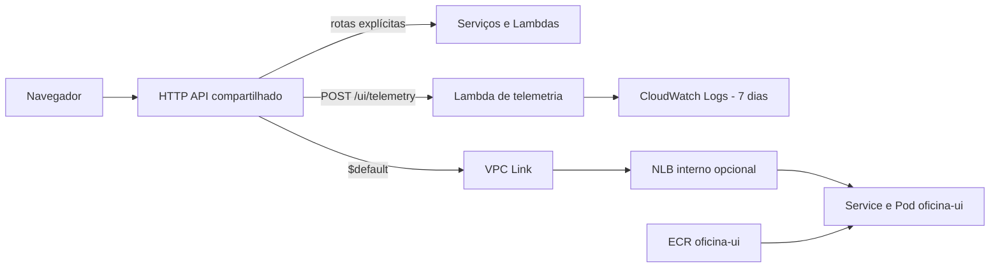

# Workload opcional da UI

A composição `terraform/optional/ui-hosting/lab` conecta o `oficina-ui` ao EKS compartilhado sem transformar o frontend em requisito da infraestrutura principal. Ela possui state próprio e cria somente os recursos de entrega necessários à UI.

## Arquitetura

As rotas explícitas das APIs têm precedência sobre `$default`. Dessa forma, a URL raiz serve a aplicação Angular e os contratos públicos continuam nos mesmos caminhos. O Nginx do container trata fallback de SPA, cache, CSP e headers de segurança.

## Responsabilidades

O state opcional cria:

- repositório ECR `oficina-ui`;
- NLB interno ligado ao NodePort `30084`;
- integração privada pelo VPC Link existente;
- rota `$default` no HTTP API compartilhado.
- Lambda de coleta da telemetria sanitizada do navegador;
- rota explícita `POST /ui/telemetry`, permissão de invocação e grupo de logs com retenção de sete dias.

O repositório `oficina-ui` mantém Dockerfile, Nginx, Deployment, Service, probes, recursos e pipeline de rollout. O state principal apenas publica outputs estáveis para composições opcionais; não cria nem implanta a UI. A composição opcional também publica `ui_observability_endpoint` e `ui_observability_log_group`, consumidos pelo deploy e pela homologação.

## Execução e remoção

O workflow `UI Workload Infrastructure Lab` permite `plan`, `apply` ou `destroy`. O backend continua em `oficina/lab/optional/ui-hosting/terraform.tfstate`, permitindo remover ECR, NLB e rota sem alterar bancos, EKS, mensageria ou APIs explícitas.

O deploy da UI também aplica essa composição de forma idempotente antes de publicar a imagem. Ele deriva automaticamente o bucket e a região dos states. Não há variáveis funcionais obrigatórias além das credenciais AWS temporárias.

Os workflows `Suspend Lab` e `Resume Lab` coordenam o ciclo de vida entre os dois states. Antes de remover o EKS e o VPC Link, o suspend aplica `create_ui_workload=false` na composição opcional, removendo somente rota `$default`, integração privada e NLB. O ECR e a telemetria permanecem ativos. Depois de recriar o plano computacional, o resume aplica `create_ui_workload=true` e, quando a imagem `latest` já existe no ECR, reaplica os manifests canônicos obtidos do repositório `oficina-ui`, recria o ConfigMap de runtime e aguarda o rollout. Quando o state opcional ainda não existe, ambos ignoram essa etapa para preservar o caráter opcional da UI. A restauração automática pode ser desabilitada pontualmente com `RESTORE_UI_WORKLOAD=false`.

Ao migrar da tentativa anterior de S3/CloudFront, o primeiro apply remove do state opcional o bucket e a configuração de website que não chegaram a publicar a aplicação por limitações da role `voclabs`.
